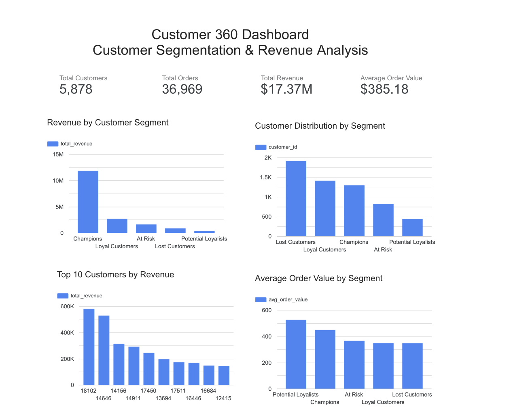
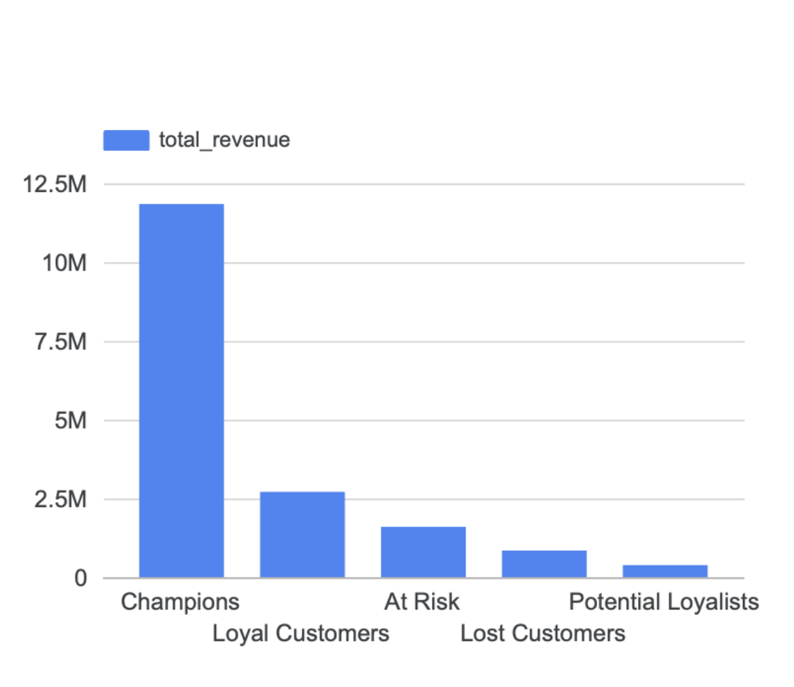
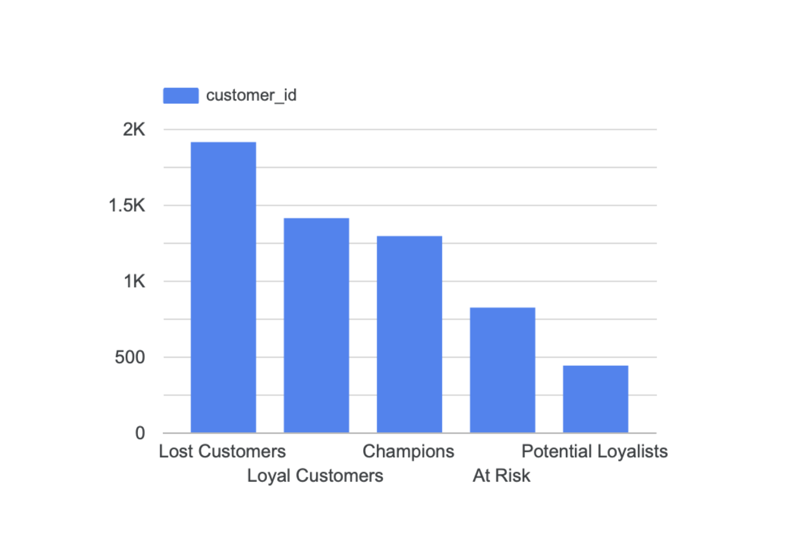
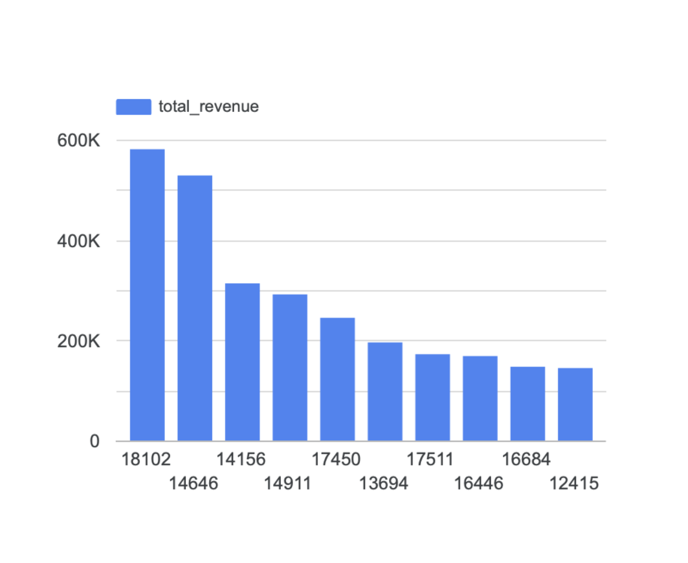
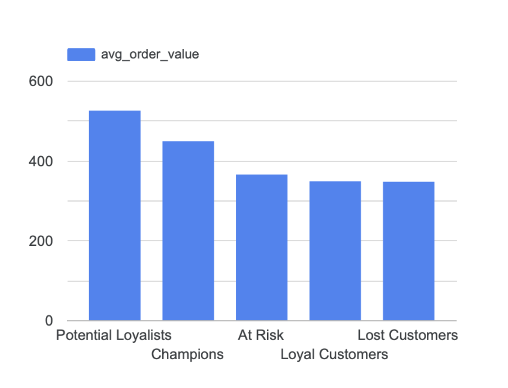

# customer-360-dashboard
Customer 360 Analytics Dashboard built using Google BigQuery, SQL, and Looker Studio for customer segmentation and revenue analysis.

---

## Project Overview

Businesses need a unified view of their customers to make informed marketing and retention decisions. This project creates a Customer 360 dashboard that combines customer metrics, revenue insights, and segmentation analysis into an interactive dashboard.

The dashboard provides key business metrics and visualizations to help stakeholders understand customer performance and identify opportunities for growth.

---

## Business Problem

Companies often struggle to answer questions such as:

- How many active customers do we have?
- Which customer segments generate the most revenue?
- Which customers contribute the highest revenue?
- Which customer segments have the highest purchasing value?
- Where should retention efforts be focused?

This dashboard answers these questions using SQL-based analytics.

---

## Technologies Used

- Google BigQuery
- SQL
- Looker Studio
- Google Cloud Platform (GCP)

---

## Dashboard KPIs

The dashboard includes the following KPIs:

- Total Customers
- Total Orders
- Total Revenue
- Average Order Value

---

## Dashboard Preview

### Customer 360 Dashboard



---

## Dashboard Visualizations

### Revenue by Customer Segment

Shows how much revenue is generated by each customer segment.



---

### Customer Distribution by Segment

Displays the number of customers in each customer segment.



---

### Top 10 Customers by Revenue

Highlights the highest revenue-generating customers.



---

### Average Order Value by Segment

Compares purchasing behavior across customer segments.



---

## SQL Queries Included

The repository contains all SQL queries used to generate dashboard metrics and visualizations.

```text
sql/
├── 01_dashboard_kpis.sql
├── 02_customer_distribution.sql
├── 03_revenue_by_segment.sql
├── 04_top_10_customers_by_revenue.sql
└── 05_average_order_value_by_segment.sql
```

---

## Repository Structure

```text
customer-360-dashboard/
│
├── README.md
├── LICENSE
│
├── dashboard/
│   └── customer360_dashboard.pdf
│
├── images/
│   ├── customer360_dashboard.png
│   ├── revenue_by_segment.png
│   ├── customer_distribution.png
│   ├── top10_customers.png
│   └── average_order_value.png
│
└── sql/
    ├── 01_dashboard_kpis.sql
    ├── 02_customer_distribution.sql
    ├── 03_revenue_by_segment.sql
    ├── 04_top_10_customers_by_revenue.sql
    └── 05_average_order_value_by_segment.sql
```

---

## Key Insights

- Champions contribute the highest share of overall revenue.
- Lost Customers represent the largest customer segment by count.
- Potential Loyalists have the highest average order value.
- Revenue is concentrated among a relatively small number of high-value customers.
- Customer segmentation enables targeted retention and marketing strategies.

---

## Skills Demonstrated

- SQL Aggregations
- JOIN Operations
- GROUP BY Analysis
- Customer Segmentation
- KPI Development
- Business Intelligence
- Dashboard Design
- Data Visualization
- Google BigQuery
- Looker Studio

---

## Future Improvements

- Add interactive date filters
- Include customer lifetime value (CLV)
- Add monthly revenue trends
- Build retention and churn analysis
- Predict high-value customers using machine learning

---

## Author

**Gouri Sri Bolloju**

GitHub: https://github.com/gouribolloju-oss
